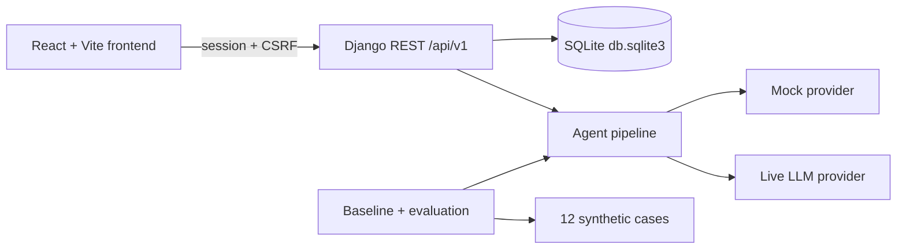

# ReferralGuard

**Hackathon prototype — synthetic data — not for clinical use.**

ReferralGuard helps midwives, nurses, physician assistants, and doctors detect missing, contradictory, and unsupported information in an emergency maternity referral **before** the patient leaves the referring facility. It then matches clinician-confirmed needs against synthetic facility capabilities and time-stamped availability. A qualified clinician must approve the referral and personally confirm acceptance with the receiving facility.

## Important disclaimers

- This is a **decision-support and documentation-verification prototype**.
- It must **never** diagnose, recommend treatment, invent missing clinical information, automatically select a destination, or claim that synthetic availability is real.
- **Documentation readiness is not medical clearance.** Blocking applies only to labelling a handoff as fully verified — never to real emergency care or transport.
- Role `QUALIFIED_REVIEWER` is **not** proof of professional qualification. This prototype has **not** been clinically validated unless separately recorded expert review is obtained.
- Single-machine, modest-concurrency demonstration — **not** a certified multi-hospital production deployment.

## User / bottleneck / value / primary metric

| Item | Statement |
|------|-----------|
| **User** | Referring clinician preparing an emergency maternity referral |
| **Bottleneck** | Incomplete, contradictory, or unsupported referral documentation and unclear receiving-facility fit under time pressure |
| **Value** | Structured verification + evidence-linked findings + human-gated handoff before transport documentation is labelled “fully verified” |
| **Primary metric** | Critical omission and contradiction **recall** on a frozen 12-case synthetic suite |

## Architecture



Monorepo layout: `backend/` (Django apps), `frontend/` (React), `data/synthetic/`, `evaluation/`, `trajectories/`, `docs/`, `scripts/`.

## Quick start

See [RUN_AND_TEST_GUIDE.md](RUN_AND_TEST_GUIDE.md) (generated from verified commands) and [REPRODUCTION.md](REPRODUCTION.md).

**Manual testing after clone:** [CLONE_TEST_GUIDE.md](CLONE_TEST_GUIDE.md) — happy path + inconsistent EVAL cases.

**Ready to submit?** See [CLONE_TEST_GUIDE.md](CLONE_TEST_GUIDE.md) (judge script) and [SUBMISSION_CHECKLIST.md](SUBMISSION_CHECKLIST.md). Local owner notes: copy `SUBMIT_NOW.md` from your session if present — it is gitignored and not pushed.

```powershell
# Windows PowerShell (from repo root)
py -3.11 -m venv .venv
.\.venv\Scripts\Activate.ps1
python -m pip install -r backend\requirements.txt
Copy-Item .env.example .env
# Set BOOTSTRAP_SUPERADMIN_PASSWORD in .env
python backend\manage.py migrate
python backend\manage.py bootstrap_demo
python backend\manage.py runserver 127.0.0.1:8000
```

```powershell
# Second terminal
cd frontend
npm ci
npm run dev
```

- App UI: http://127.0.0.1:5173  
- API: http://127.0.0.1:8000/api/v1/  
- OpenAPI: http://127.0.0.1:8000/api/schema/swagger-ui/  
- Django Admin: http://127.0.0.1:8000/admin/

## Figma

Design source: [ReferralGuard Figma](https://www.figma.com/design/3J3sDtp9pfs1bFHwedRqlp/ReferralGuard-%E2%80%94-Emergency-Maternity-Referral-System). Cursor session had **no Figma MCP**; visual match depends on exported screenshots when available.

## Evaluation results

| Mode | Baseline recall | Agent recall | Artifact |
|------|-----------------|--------------|----------|
| Mock | (dev only) | 1.0 | Re-run `--mode mock` |
| **Live** (2026-08-31) | **0.0** | **1.0** | [`evaluation/results/comparison-live.md`](evaluation/results/comparison-live.md) |

12 synthetic cases — prototype behaviour, not clinical efficacy.

## Hot take / main failure mode

- **Hot take:** Structured referral defects are checklist problems. Deterministic rules + human gates outperform a single free-form LLM prompt; the LLM should assist extraction, not be the primary safety net.
- **Main failure mode:** Single-prompt baseline (and mock scores treated as “AI”) miss critical omissions. Live evidence: baseline recall **0.0** vs agent **1.0** on the same 12 cases — see [`IMPROVEMENT_CHANGELOG.md`](IMPROVEMENT_CHANGELOG.md) and [`evaluation/results/comparison-live.md`](evaluation/results/comparison-live.md).

## Limitations

- Synthetic facilities and availability only.
- Mock LLM mode is for offline UI/smoke tests — **not** the measured improvement claim.
- Live comparison requires provider credentials; artifacts are archived under `evaluation/results/*-live.*`.
- `QUALIFIED_REVIEWER` is an application role label only — not proof of professional qualification.

## License

MIT — see [LICENSE](LICENSE).
