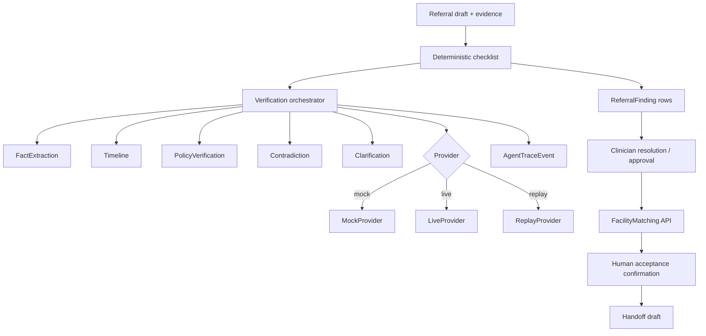

# Agent architecture

## Design

ReferralGuard uses **one orchestrated verification workflow** with bounded tools and heavy **deterministic** checks. Logical agent names describe responsibilities; they are not seven mandatory independent LLM calls.

## Providers

| Mode | Purpose |
|------|---------|
| `mock` | Offline UI, smoke, contract tests — **MOCK - not an AI benchmark** |
| `live` | Real LLM via env vars; **fails loudly** if key/model missing or API errors |
| `replay` | Stored sanitized outputs for judges without credentials |

## Policy

`backend/agents/policy/provisional_checklist_manifest.json` — provisional demonstration checklist. **Not** claimed as verified against official GHS guidance.

## Trajectories

See `trajectories/` for sanitized representative traces of runtime stages actually used.
